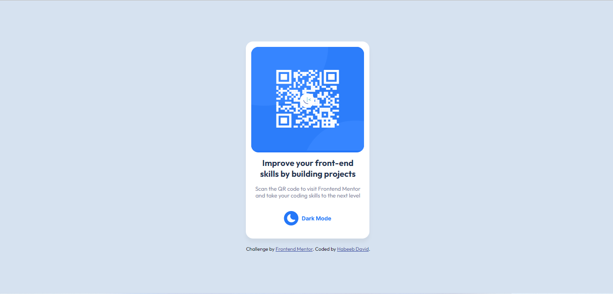
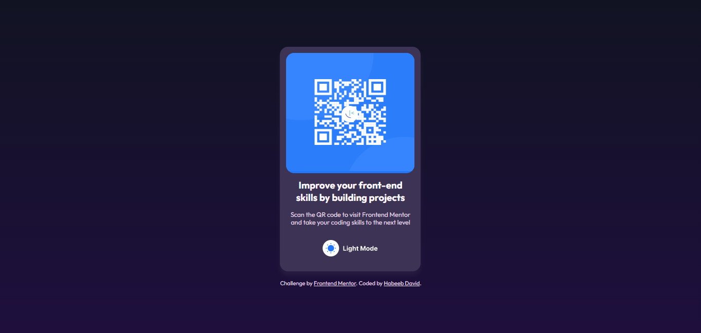
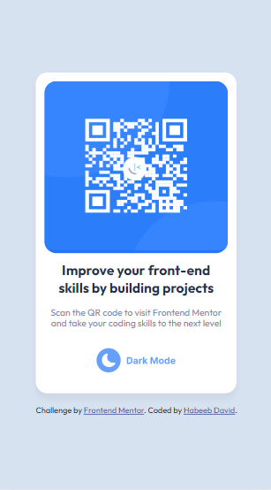
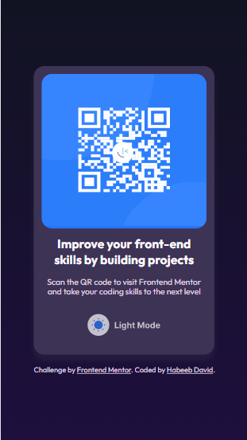

# Frontend Mentor - QR code component solution

This is a solution to the [QR code component challenge on Frontend Mentor](https://www.frontendmentor.io/challenges/qr-code-component-iux_sIO_H). Frontend Mentor challenges help you improve your coding skills by building realistic projects.

## Table of contents

- [Overview](#overview)
  - [Screenshot](#screenshot)
  - [Links](#links)
- [My process](#my-process)
  - [Built with](#built-with)
  - [Continued development](#continued-development)
  - [Useful resources](#useful-resources)
- [Author](#author)

## Overview

### Screenshot

Desktop Version

Mobile Version

### Links

- Solution URL: [Add solution URL here](https://d-code-h.github.io/qr-code-component-main)
- Live Site URL: [Add live site URL here](https://d-code-h.github.io/qr-code-component-main)

## My process

### Built with

- Semantic HTML5 markup
- CSS custom properties
- Flexbox
- Mobile-first workflow
- [Styled Components](https://styled-components.com/) - For styles

### Continued development

I will love to strengthen my color matching skills and Css flexbox.

### Useful resources

- [Font](https://fonts.google.com/specimen/Outfit) - Make use of font weight 400 and 700.
- [Hosting](https://pages.github.com/) - An amazing step by step process in creating github pages. Highly recommended!

## Author

- Contact - +2349060260210
- Twitter - [@rain1_bow1](https://www.twitter.com/rain1_bow1)
